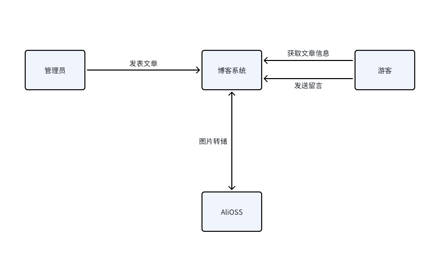
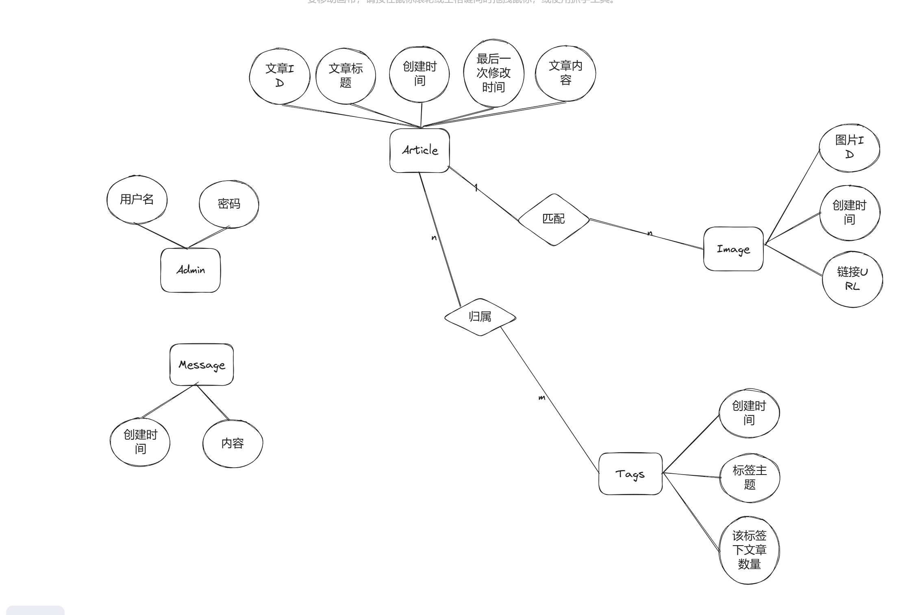

## 1. 系统结构设计

## 2. 接口设计

### BLOG

PUT /api/blog 修改

DELETE /api/blog 删除

POST /api/uploadblog 上传

POST /api/blogitem 详情

POST /bloglist 列表

### Message

DELETE /api/message 删除

GET /api/message 获取

POST /api/message 上传

### AUTH

POST /api/login 登录

### Tage

GET /api/tag 获取标签

## 3. 过程设计

## 4. 数据设计

