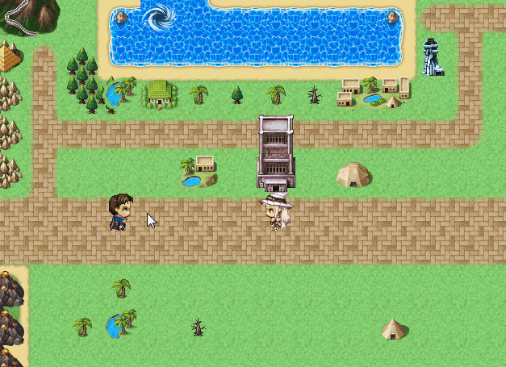
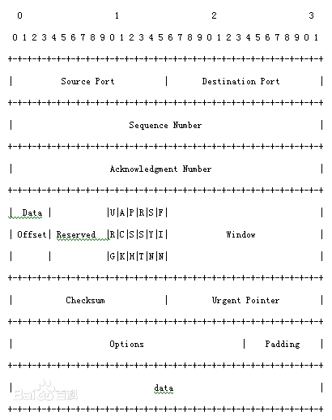
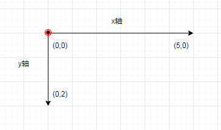
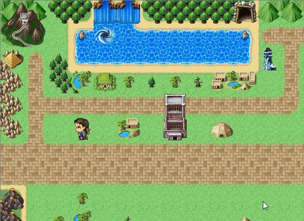
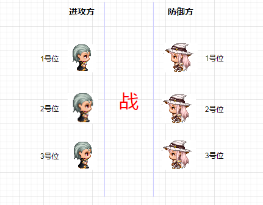
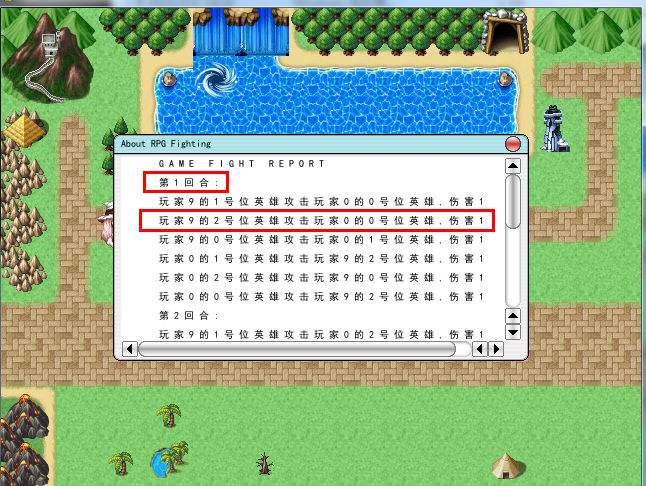

# 从零开始做回合制游戏

## 零、简介

大家好， 跟随教程我们将会制作一个简单的 **联机回合制游戏**。在游戏中你可以点击一个地块然后指挥地图上的小人走向它，也可以和朋友联机，进行一场自动的回合制PK，战斗后会生成文字战报。

下图是游戏的完成形态：




本教程把各个功能拆分成独立的章节进行实现，具体的代码见 [code](code) 目录 (使用 **“ctrl+鼠标左键”** 点击跳转，以下所有链接均采用此方式)。


课程介绍完毕，正文立马开始。不过在进入下一章之前，需要先完成 前置准备, 安装必备的依赖。


## 一、网络通信
----
作为一个可联机的回合制游戏，这里采用了常见的Client-Server架构，远程的Server负责数据的管理，本地的Client负责和玩家的交互。那么我们很快就能意识到一个问题，Client和Server是怎么进行数据通信的呢？
好消息是python提供了一个标准库：socket，它提供了一系列接口用于进行网络上两个端点(IP+Port)之间的连接。


socket库创建了一个**socket对象**，用于表示网络上两个端点之间连接的实体。通过调用socket对象相关接口，可以实现通信。我们先来看下创建socket对象的函数原型：`socket.socket(family=AF_INET, type=SOCK+STREAM, proto=0, fileno=None)`

通过改变参数famlily和type，可以选择使用tcp传输数据，数据能可靠传达
也可以使用udp传输数据，数据不可靠传达
这里为了数据安全，我们采用了前者。


在OSI参考模型中，tcp/udp属于传输层，负责在端对端(IP+Port)之间传达数据。而从上面的函数原型可知，socket使用到了tcp/udp这样的传输层，显然它的层次是高于传输层的。事实上，socket是属于**会话层**，它的作用是使用传输层**建立**连接、**管理**连接、**释放**连接。


我们先来看一个简单的服务端与客户端通信的例子，下图为服务端代码：

首先创建CServer()对象用于管理socket连接，在第12行创建socket对象，并进行参数设置。

```python
import socket

class CServer():
	def __init__(self):
		self.m_IP = "127.0.0.1"
		self.m_Port = 8888
		self.m_MaxSize = 1024
		self.m_Socket = None
	
	def run(self):
		print("这里是服务端")
		#创建socket对象
		oSocket = socket.socket()
		
		#设置端口可复用
		oSocket.setsockopt(socket.SOL_SOCKET, socket.SO_REUSEADDR, 1)
		
		#绑定并监听对应端口
		oSocket.bind((self.m_IP, self.m_Port))
		
		#最多等待5个连接,超过后拒绝连接
		oSocket.listen(5)
		self.m_Socket = oSocket

oServer = CServer()
oServer.run()
```


参数设置完成后，我们在run()中添加通信的逻辑：

代码中有个不常见的while True循环体，那么会不会无限循环卡死呢？答案是不会，因为accept()和recv()都是阻塞的方法，直到满足新连接或有新消息时才会继续执行。

```python
class CServer():
    ...
    def run(self):
        oSocket = socket.socket()
        oSocket.setsockopt(socket.SOL_SOCKET, socket.SO_REUSEADDR, 1)
        oSocket.bind((self.m_IP, self.m_Port)
        oSocket.listen(5)
        self.m_Socket = oSocket

        while True:
            #调用accept，这里会一直阻塞，直到有客户端连接了端口。
            #然后生成oLink，oLink其实也是socket对象，它是本次某个客户端连接到服务器的实体
            oLink, address = self.m_Socket.accept()

            #等待客户端发送消息过来
            sMsg = oLink.recv(self.m_MaxSize)
            print("收到客户端消息 %s" % sMsg)

            sReply = sMsg + b" OK"
            #服务器向客户端发送sReply
            oLink.sendall(sReply)

            #通信完成，关闭连接
            oLink.close()

            #继续while True循环体，等待下一个客户端连接         	
```


下面给出客户端的代码，首先执行初始化参数，并向指定IP+Port发起连接：

```python
import socket

class CClient():
	
	def __init__(self):
		self.m_IP = "127.0.0.1"
		self.m_Port = 8888
		self.m_MaxSize = 1024
	
	def run(self):
		print("这里是客户端")
		self.m_Socket = socket.socket()
		
		#向指定IP+端口发起连接
		self.m_Socket.connect((self.m_IP, self.m_Port))
		
oClient = CClient()
oClient.run()
```


初始化参数完毕后，我们修改run()添加与服务端通信的逻辑。

```python
class CClient():
    ...   
    def run(self):
        self.m_Socket = socket.socket()
        self.m_Socket.connect((self.m_IP, self.m_Port))

        #调用sendall接口向服务端发送消息
        sPack = b"Hello"
        self.m_Socket.sendall(sPack)

        #等待服务器回应消息
        sAns = self.m_Socket.recv(self.m_MaxSize)
        print("收到消息", sAns)

        #通信完毕释放连接
        self.m_Socket.close()
```

上述的demo确实能实现通信了，但是我们注意到其仍存在很大局限性。比如规定了一次连接，客户端只发一次消息，再接受一次消息，然后就释放了连接。如果客户端想要连续发送2个消息，那么上述代码就不适用了。

其实问题的根源在于，我们需要一个连接 **并发** 的做两件事情，在等待接收另一端的消息时，可以**同时**任意次数的进行发送消息。很直接的可以想到可以利用多线程来处理。Python提供了threading模块操作多线程，具体代码详见  [code](./code) 目录的1.2章节，这里不要求掌握。

同时多线程的引入会带来线程安全的问题，一个解决办法是使用锁机制，代码详见1.3章节，这里不要求掌握。

另外，由于这里传输选择了tcp，而tcp是面向流的协议，这就意味着连续多次发的数据，会合并在一起，像流一样无间断的送达。所以需要将收到的流按规则分隔开，代码详见1.4章节，这里不要求掌握。


## 二、协议
在上一章节中，我们通过socket实现了连接的创建、管理、销毁，这属于OSI七层模型中的**会话层**。
那么连接传输的2进制数据，怎么才能翻译成有意义的信息呢？这就是我们这一章要做的事情：协议设计。它作用于OSI模型中的**表示层**
要体会 <font color='red'>协议</font> 的含义，我们可以从tcp协议这个例子入手


上图是一个网络上的数据包，使用到了tcp协议。数据以2进制的形式，从上到下有序排列，每一行有32位bit. 
第一行，前16bit换算成无符号整数，代表着tcp传输所使用到的源端口号，接着16bit换算成无符号整数代表着目标端口号。后续字节依次类推可以翻译出他们的真正含义。

这启发我们，可以约定好2进制流中，开始几位代表什么信息，再接着几位又代表什么信息，那么就能将看似杂乱无章的2进制流，转换成有意义的信息。事实上，这就是协议的设计。我们来看下具体实践：

这里是客户端的代码，由于直接操作二进制流不够简便，这里采取替代办法使用列表。如16行，第一个元素是标记位，这里代表“向服务器全体在线玩家广播消息”这个动作。列表第二个元素是这个动作所需的参数“广播消息的具体值”。这样我们就通过一个列表蕴含了“向服务器全体在线玩家广播Hello这条消息”。

但是socket连接无法直接传输列表，因此我们使用 **marshal** 这个标准库，将列表转换成二进制流。

```python 
import socket
import marshal

class CClient():
	
	def __init__(self):
		self.m_IP = "127.0.0.1"
		self.m_Port = 8888
		self.m_MaxSize = 1024
	
	def run(self):
		self.m_Socket = socket.socket()
		self.m_Socket.connect((self.m_IP, self.m_Port))
		
		#1代表“向服务器全体在线玩家广播消息”, "Hello"是消息的具体值
		lstPack = [1, "Hello"]
		
		#将列表转换成二进制流
		sPack = marshal.dumps(lstPack)
		self.m_Socket.sendall(sPack)					#连接建立后,通过此连接发送消息
		
oClient = CClient()
oClient.run()
```


至此已经完成协议的客户端部分，那接下来看下服务器收到连接传输的二进制流后，如何解析的。

(1) 服务端收到客户端的连接，在第24行创建了CLink对象用于管理连接中消息的解析。

```python
import socket
import clientsocket.clientobject

class CServer(object):
	
	def __init__(self):
		self.m_Socket = socket.socket(socket.AF_INET, socket.SOCK_STREAM)
		self.m_Socket.setsockopt(socket.SOL_SOCKET, socket.SO_REUSEADDR, 1)
		self.m_Socket.bind(("127.0.0.1", 6666))
		self.m_Socket.listen(5)
		self.m_MaxSize = 1024
        #连接序号，每次自增1
        self.m_UID = 0
        #所有客户端的连接，key是连接序号，val是客户端连接的管理对象CLink
        self.m_Item = {}
		
	def Start(self):
		while True:
			oSocket, tAddress = self.m_Socket.accept()
            ip, port = tAddress
            self.m_UID += 1
            
            #创建这个客户端连接的管理
            oLink = clientsocket.clientobject.CLink(self.m_UID, oSocket, ip, port)
            self.m_Item[self.m_UID] = oLink
```

（2）CLink中使用marshal.loads()将二进制流还原成列表，并记录在m_RecvPackInfo属性中。

同时实现了UnpackHead()方法，截取列表的第一个元素,留下剩余部分。这样通过不断的调用，就能依次截取出列表的每一段元素。

```python
class CLink(threading.Thread):
    def __init__(self, uid, oSocket, ip, port):
        threading.Thread.__init__(self)
		self.m_ID = uid
		self.m_oSocket = oSocket
		self.m_IP = ip
		self.m_Port = port
        self.m_RecvPackInfo = []	#[1, 5, "哈哈"] 当前收到的数据
        
	def run(self):
		sData = self.m_oSocket.recv(self.m_MaxSize)
        #将二进制流还原成列表,并记录下来
		self.m_RecvPackInfo = marshal.loads(sData)
        
        #翻译列表，后续介绍
        commandctrl.OnCommand(self)

    #截取列表的第一个元素,留下剩余部分  例[1,"Hello"] -> ["Hello"]
	def UnpackHead(self):
		if not self.m_RecvPackInfo:
			return None
		return self.m_RecvPackInfo.pop(0)
```

(3)将列表解析成对应的指令，然后去执行。

现在介绍上文用到的commandctrl.OnCommand()的实现，它调用了CCommandManager这个类。

它的m_CommandDict，将标记1映射到元组("test", "BroadcastMsg")，代表着test模块的BroadcastMsg方法。

```python
class CCommandManager():
	def __init__(self):
		self.InitCommand()
	
	def InitCommand(self):
		self.m_CommandDict = {
			#1对应test模块的BrocastMsg方法
			1 : ("test", "BroadcastMsg"),
		}
    
    def OnCommand(self, oLink):
        pass
```


现在我们来看下OnCommand()的实现。首先截取列表的第一个元素1，找到对应的模块"test"，及方法“BroadcastMsg”。接着导入模块，并执行对应方法。

```python
import importlib

class CCommandManager():
	def __init__(self):
		self.InitCommand()
	
	def InitCommand(self):
		self.m_CommandDict = {
			1 : ("test", "BroadcastMsg"),
		}

	def OnCommand(self, oLink):
		#截取列表中的第一个元素
		iProtocol = oLink.UnpackHead()
		if not iProtocol in self.m_CommandDict:
			return 
		sImport, sFunc = self.m_CommandDict[iProtocol]
		
		#根据文件名导入对应的模块
		oModule = importlib.import_module(sImport)
		
		#在模块中找到对应方法
		oFunc = getattr(oModule, sFunc, None)
		if not oFunc:
			return
		
		#调用方法
		oFunc(oLink)
```


下图是test.BroadcastMsg()的实现，在方法中继续截取列表得到客户端传来的 "Hello"

```python
def BroadcastMsg(oLink):
	sMsg = oLink.UnpackHead()
	print("执行对全服广播消息 : %s" % sMsg)
```


至此客户端向服务端发送协议的解析完成。那么服务端如何向客户端发送协议呢？

（1）添加协议的元素进列表。

这里我们使用前文中连接的管理CLink对象。增加PacketAdd()和DataExpand()方法。通过不断调用PacketAdd()，可以按序添加协议的元素进列表。

```python
class CLink(threading.Thread):
    def __init__(self, uid, oSocket, ip, port):
		...
        self.m_SendPackInfo = []	#[1, 5, "哈哈"] 当前要发的数据
        
	def run(self):
		...

	def UnpackHead(self):
		...
      
	#压包进数据
	def PacketAdd(self, val):
		self.m_SendPackInfo.append(val)
		
	#多重压包
	def DataExpand(self, lstVal):
		self.m_SendPackInfo.extend(lstVal)
```


（2）将列表转换成二进制流发送。

在CLink中添加PacketSend()方法

```python
class CLink(threading.Thread):
    ...
    
    def PacketSend(self):
        #将列表转换成二进制流
        sData = marshal.dumps(self.m_SendPackInfo)
        #使用socket对象发送数据
        self.m_oSocket.sendall(sData)
```


这里给出向客户端发送协议的实际例子，方便理解：

```python
def S2CNotify(oLink, sMsg):
    #添加第一个元素1，代表“在客户端弹窗消息”这个功能
    iProtocol = 1
    oLink.PacketAdd(iProtocol)
    
    #添加第二个元素sMsg，这是弹窗消息的具体值
    oLink.PacketAdd(sMsg)
    
    #将列表转换成二进制流，并通过socket对象发送给客户端
    oLink.PacketSend()
```


至此网络部分介绍完毕，现在正式进入游戏玩法的实现。


## 三、登录
进入游戏，一个必不可少的环节就是登录。
玩家在登录时需要输入账号密码，如此服务器可以验证使用者身份，避免私人的账号被他人使用。
另外在登录时服务器可以根据账号找到对应的游戏数据，记录历史的游戏进度。

这里来看下登录的实现。登录时客户端发送了账号和密码，这里我们利用第二章协议的解析，将登录请求定向到服务端LoginCheck的调用。首先执行UnpackHead()分别得到账号和密码。然后尝试从oObjManager（CPlayer的管理器）中根据账号获取到oPlayer对象。

如果这个账号在本次启服后登陆过，那么之前登陆时就会将oPlayer对象添加到oObjManager的引用中，从而此次直接在内存中就能获取到oPlayer对象。

如果这个账号在本次启服后未登陆过，那么内存中就无oPlayer对象，则尝试新建oPlayer对象并从数据库加载数据。

```python
def LoginCheck(oLink):
    #CPlayer对象的管理器
	oObjManager = pubglobalmanager.GetGlobalManager("saveobjmanager")
	sPlayerID = oLink.UnpackHead()
	sClientPwd = oLink.UnpackHead()
	iPlayerID = int(sPlayerID)
	oPlayer = oObjManager.GetItem(iPlayerID)
    
    #获取不到oPlayer，即玩家对象实体不在内存中
	if not oPlayer:						
        #创建玩家对象
		oPlayer = CPlayer(iPlayerID)
        
        #尝试从数据库读取该账号历史数据
		oPlayer.Init()					
```


如果数据库加载不到数据，代表这是个新账号，那么执行初始化逻辑，比如设置sClientPwd为该账号初始密码。

```python
def LoginCheck(oLink):
    #oPlayer对象的管理器
	oObjManager = pubglobalmanager.GetGlobalManager("saveobjmanager")
	sPlayerID = oLink.UnpackHead()
	sClientPwd = oLink.UnpackHead()
	iPlayerID = int(sPlayerID)
	oPlayer = oObjManager.GetItem(iPlayerID)
	if not oPlayer:						
		oPlayer = CPlayer(iPlayerID)
		oPlayer.Init()	
	
    #该账号无历史数据，即第一次创建账号
	if oPlayer.IsNew():
        #执行初始化逻辑，比如设置sClientPwd为该账号初始密码
		oPlayer.NewCreate(sClientPwd)
        
        #一些登录相关变量的设置
		oPlayer.SetSocketID(oLink.m_ID)
		oLink.SetPlayerID(iPlayerID)
        
        #执行登录后续流程比如 刷新数据等
		oPlayer.RealLogin()				
		return
```


如果加载到历史数据，那么需要验证密码是否正确。

```python
def LoginCheck(oLink):
    ...
    #该账号有历史数据，即旧账号，需要校验密码
	sPwd = oPlayer.Query("Pwd")			
	if sPwd != sClientPwd:
		return
	oPlayer.SetSocketID(oLink.m_ID)
	oLink.SetPlayerID(iPlayerID)
    #执行登录后续流程比如 刷新数据等
	oPlayer.RealLogin()					
```

至此登录的流程介绍完毕。注意到流程中需要从数据库读取数据，那么对于数据库存盘和加载是如何实现的呢？我们将在下一章介绍。


#### 练习
根据教程中的写法，在  [code第三章](code)  补全server.player.LoginCheck()方法，完成登录流程。

双击startserver.bat和startclient.bat，启动服务器和客户端。测试效果。当出现世界地图界面即为登录成功

tips：注意错误提示，以便快速定位问题。


## 四、数据的存盘与加载
数据的存盘和加载有个简单办法：直接读写文件。但是一旦数据量变大，数据结构变复杂时，便不太适用了。
另外还有个安全稳定的持久化数据方法：使用数据库。数据库我们选择流行的关系型数据库--mysql。
那么如何使用python语句操作mysql呢？可以使用python的第三方库pymysql，这个库在序章我们已经安装完毕了。


如下对CPlayer的数据进行存盘，在Save()方法中将CPlayer的所有属性转化成字典保存。CPlayer继承的CSaveData类会定时调用Save()方法，将其返回值通过pymysql库的相关接口存储到数据库中。

```python
import dbctrl.saveobject
import pubglobalmanager

class CPlayer(dbctrl.saveobject.CSaveData):
	
	def __init__(self, iPlayer):
		super(CPlayer, self).__init__(iPlayer)
		#玩家的一些数据
        self.m_Data = {}
			
    #存储数据
	def Save(self):
		dData = {}
        dData["Data"] = self.m_Data
		return dData
    
    #读取数据
	def Load(self, dData):
		pass
```


数据的加载同理，如下图的 CPlayer.Load() 方法。注意到 dData 的key值 **"Data"** 是 Save() 方法中确定的。

```python
class CPlayer(dbctrl.saveobject.CSaveData):
    ...
    
    def Load(self, dData):
        if not dData:
            return
        self.m_Data = dData["Data"]
```


#### 练习

支持在登录后打印账户创建的时间，最终效果见练习2.png

提示： 在CPlayer对象内用CPlayer.m_CreateTime属性记录第一次创建的时间戳
修改server.player.CPlayer.Save()和server.player.CPlayer.Load()，对CPlayer.m_CreateTime进行存盘和读取


## 五、世界地图

在之前的章节，我们介绍了登录及使用到的存盘和定时器。本章开始介绍登录后的玩法--世界地图。
如序章的介绍，世界地图是二维平面，我们将其切割成等大的方格，用坐标(x,y)来指定第x列，第y行的那个方格。如下图原点为(0,0)  水平方向为x轴，垂直方向为y轴：




本次教程不实现地图上的可交互物件，因此地图上的帐篷，房子等除了视作阻挡外，并无其他属性。这里我们用二维列表A来记录这些阻挡。如果坐标(x,y)有个阻挡，那么A\[y][x]的值为1，其余下标的值为0. 

例如(2,0)这个坐标有个帐篷，那么二维数组如下图所示：

[

​		[0, 0, 1],

​		[0, 0, 0],

]


地图上除了阻挡外，还有玩家小人。这里需要创建玩家小人对象（以下均为服务端代码）：

Map属性代表的是地图对象，后续介绍。UnitIdx是每个玩家小人对象独一无二的序号。Pos指代的小人当前坐标。Owner指代玩家账号ID。其余为小人移动相关的属性。

```python
class CPlayerUnit(object):
	
	m_MoveTime = 0.4				#移动一格所需的时间
	
	def __init__(self, oMap, iUnitIdx):
		self.m_Map = oMap
		self.m_UnitIdx = iUnitIdx	#小人序号
		self.m_Pos = (0, 0)			#当前坐标
		self.m_Owner = 0
		
        #移动相关属性
		self.m_Moving = 0			#是否在移动中
		self.m_MovePath = []		#移动坐标路径  如[(1,1), (2,1), (3,1)]
		self.m_MovePathIdx = 0		#走到了路径第X序号的坐标
		self.m_StepStart = (0, 0)	#从坐标出发的时间
		self.m_NewMovePos = None	#移动过程中，改变目的地
```


下面介绍地图这个对象：

由于地图管理着所有类似玩家小人这样的物件，因此有必要给每个物件一个独一无二的序列号。每次新创建一个地图物件，UnitIdx便会自增1，并分配给它作为序列号。同时记录进MapUnit字典，进行管理。

```python
class CMap(object):
	
	def __init__(self):
        #地图上的物件序列号
		self.m_UnitIdx = 0
        
        #地图物件索引,key是序列号,value是物件对象
		self.m_MapUnit = {}
        
        #阻挡的二维列表
		self.m_Block = []
        
	def NewUnitIdx(self):
		self.m_UnitIdx += 1
		return self.m_UnitIdx
    
    #创建新玩家小人
	def NewPlayerUnit(self, iPlayer):
		iUnitIdx = self.NewUnitIdx()
		oUnit = mapunit.CPlayerUnit(self, iUnitIdx)
		self.m_MapUnit[iUnitIdx] = oUnit
		return oUnit    
```




接下来我们介绍下小人的移动。当玩家点击地块时，小人会自动找到一条路径， **绕过** 阻挡到达指定坐标。这里使用了 A*寻路算法，代码见server/mapobj/astar, 这里不做介绍。 在此基础上，我们来看下移动的具体实现。

小人的移动最终调用了CPlayerUnit.Move()方法。首先判断如果此时静止状态，那么使用A*算法找到一条路径。然后等待小人走一格的时间，再执行CPlayerUnit.MoveStepDone()，修改坐标为下一格。

如果此时仍在移动中，那么记录下新目的地坐标，等小人移动到下个格子，更换成新目的地的路径。

```python
class CPlayerUnit():
	
	m_MoveTime = 0.4				#移动一格所需的时间
	
	def __init__(self, oMap, iUnitIdx):
		self.m_Map = oMap
		self.m_UnitIdx = iUnitIdx
		self.m_Pos = (0, 0)			#坐标
		self.m_Owner = 0

	def Move(self, tMovePos):
		#使用A*算法找到路径lstPath,  如[(0,0), (0,1), (0,2)]
        oAStar = astar.AStar(self.m_Map.m_Block, self.m_Pos, tMovePos)
		lstPath = oAStar.start()
		if not lstPath:
			return
         
		if not self.m_Moving:
			self.m_Moving = 1
            
            #记录从当前格子出发时的时间戳
			self.m_StepStart = TupleTime()
            
            #设置路径坐标
            self.m_MovePath = lstPath
            
			self.m_MovePathIdx = 0
            
            #定时小人走一格的时间后，执行self.MoveStepDone
			timecontrol.Call_Out(self.MoveStepDone, self.m_MoveTime, "Move%s" % self.m_UnitIdx)
		else:
            #如果在移动中，则记录下新目的地在到达下个格子后重新寻路
			self.m_NewMovePos = tMovePos
            
            #向客户端刷新移动状态
            self.Refresh()
```


注意到上文使用了定时回调的功能，这就是定时器模块timecontrl的作用。它提供了接口timecontrl.Call_Out()，

第一个参数是需要回调的方法， 

第二个参数为定时时长， 

第三参数为此次定时的标记，可以利用该标记找到并删除指定的定时器。

```python
timecontrol.Call_Out(self.MoveStepDone, self.m_MoveTime, "Move%s" % self.m_UnitIdx)
```


我们接下来看走了一格后，CPlayerUnit.MoveStepDone()的实现。

调用时代表小人一格行走结束，设置坐标为路径下一个格子。如果更换目的地，后续另行处理。否则判断是否到终点了，没到终点就设置定时器继续沿着路径往后走。

```python
class CPlayerUnit():
    ...
    
    def MoveStepDone(self):
        #设置小人坐标为路径下一个格子
        self.m_MovePathIdx += 1
        self.m_Pos = self.m_MovePath[self.m_MovePathIdx]

        if not self.m_NewMovePos:
            #行进中没有更换目的地
            #到达终点了
            if self.m_MovePathIdx >= len(self.m_MovePath)-1:
                #清除移动相关临时数据
                self.ClearMove()
                #向客户端刷新状态
                self.Refresh()
                return

            #继续往路径下一个坐标走
            tNextPos = self.m_MovePath[self.m_MovePathIdx+1]
            #如果路径下一个坐标是阻挡，则终止行动
            if self.m_Map.IsBlock(tNextPos):
                self.ClearMove()
                self.Refresh()
                return
            self.m_StepStart = TupleTime()
            oCB = Functor(UnitMoveStep, self.m_UnitIdx)
            timecontrol.Call_Out(oCB, self.m_MoveTime, "Move%s" % self.m_UnitIdx)
```


如果更换了目的地，则重新根据新目的地寻路。

```python
class CPlayerUnit()
	...
    
    def MoveStepDone(self):
        self.m_MovePathIdx += 1
        self.m_Pos = self.m_MovePath[self.m_MovePathIdx]


        if not self.m_NewMovePos:
            #行进中没有更换目的地
            ...
        else:
            #行进中更换了目的地
            self.m_Moving = 1
            oAStar = astar.AStar(self.m_Map.m_Block, self.m_Pos, self.m_NewMovePos)
            lstPath = oAStar.start()
            if not lstPath:
                self.ClearMove()
                self.Refresh()
                return

            #重新按照新目的地寻路
            self.m_StepStart = TupleTime()
            self.m_MovePathIdx = 0
            self.m_MovePath = lstPath
            self.m_NewMovePos = None
            oCB = Functor(UnitMoveStep, self.m_UnitIdx)
            timecontrol.Call_Out(oCB, self.m_MoveTime, "Move%s" % self.m_UnitIdx)
            self.Refresh()
```


至此我们完成了点击坐标后的人物移动，以及支持移动中变更目的地。但有个问题，当自己的小人移动时，别人怎么得知你移动的状态呢？这就需要依赖服务端将你的移动数据同步给他人了。

下面是前文代码中CPlayerUnit.Refresh()的实现，通过调用GetPackInfo获取到小人的信息。包括小人作为地图物件唯一的序号、地图物件类型（这里玩家小人的类型是1，可拓展）、以及一些移动相关的数据。客户端接收到这些数据即可描绘出动态的地图小人。

```python
class CPlayerUnit()
	...
    
    def Refresh(self):
        oSocketManager = pubglobalmanager.GetGlobalManager("socketmgr")
        oCommand = pubglobalmanager.GetGlobalManager("commandctrl")

        #获取需要同步的信息，包括坐标、移动状态等
        lstPackInfo = self.GetPackInfo()

        #对于所有在线玩家的客户端
        for iSocket in oSocketManager.GetAllSocket():
            #发送数据
            oCommand.S2CRefreshMapUnit(iSocket, lstPackInfo)
```

```python
class CPlayerUnit()
	...
    
    def GetPackInfo(self):
        lstPack = [
            self.m_UnitIdx,		#唯一序号 
            self.m_Type,		#类型
            self.m_Pos, 		#坐标
            self.m_Owner, 		#归属者
            self.m_Moving, 		#是否移动中
            self.m_StepStart, 	#离开上个格子的时间
            self.m_MovePathIdx, #移动路径上的格子序号
            self.m_MovePath,	#移动路径
        ]
        return lstPack
```


#### 练习

在地图坐标(4,4)生成一个地图物件“宝箱”，其非阻挡。当玩家小人 **首次** 从宝箱正上方路过时，打印文本“您打开了宝箱”。在 [code第五章](code) 编辑代码。

提示：宝箱同地图小人一样，都是地图物件。修改CPlayerUnit的m_Type为UNIT_BOX即可将小人造型换成宝箱造型。


## 六、战斗

本章介绍战斗的实现，我们先看下效果。如下图，两个玩家小人靠近会触发一场战斗，同时打印出文字战报。


#### 战斗规则

这里简化起见，战斗均为自动进行。进攻方和防御方各有三名战士，按序分为1、2、3号位置。

每名战士按照各自的速度属性排序行动。

战士的行动目前只支持普通攻击，对随机一个对手造成伤害。

所有战士行动完毕后，一轮结束。单场战斗最多持续10轮。

当达到最大轮数，或者一方全部阵亡，战斗结束。




#### 战斗实现

当玩家A移动靠近另一个玩家B时，目前客户端A自动发送一个协议告知服务器进入战斗。服务器根据A发来的iFightUnitIdx即地图物件的唯一序号，在地图上找到敌方小人对象oTarget。

然后创建战斗对象oWar，配置基本数据：己方小人对象oPlayerUnit 和 敌方小人对象oTarget。然后进入战斗

```python
class CMap(object):
    
	def EnterFight(self, oPlayer, iFightUnitIdx):
        #找到敌方小人对象oTarget
		oTarget = self.GetUnit(iFightUnitIdx)
        
        #找到己方小人对象oPlayerUnit
		oPlayerUnit = self.GetUnit(oPlayer.m_MapUnitIdx)
		if not oTarget or not oPlayerUnit:
			return
		if not isinstance(oTarget,mapunit.CPlayerUnit):
			return
        
        #创建战斗对象
		oWar = war.NewWar()
		oWar.Config(oPlayerUnit, oTarget)
        
        #战斗开始
        oWar.WarStart()
```


下面执行初始化战斗对象，这里对于攻守双方各生成3个战士对象。

```python
class CWar(object):
	
	def __init__(self):
        #当前轮数
		self.m_Turn = 0
        
        #战士对象列表
		self.m_Warrior = []
	
	def Config(self, oAttUnit, oDefUnit):
		self.m_AttUnit = oAttUnit
		self.m_DefUnit = oDefUnit
		
        #进攻方初始化
		sAttName = oAttUnit.Name()
		for iPos in range(1, 4):
            #生成3个战斗对象
			iSide = SIDE_ATTACK
			oWarrior = warrior.CWarrior(iSide, iPos)
			oWarrior.Config(self, sAttName)
			self.m_Warrior.append(oWarrior)
		
        #防守方初始化
		sDefName = oDefUnit.Name()
		for iPos in range(4, 7):
			iSide = SIDE_DEFEND
			oWarrior = warrior.CWarrior(iSide, iPos)
			oWarrior.Config(self, sDefName)
			self.m_Warrior.append(oWarrior)
```


以下为战士对象的实现，设置了一些战斗所需的基本属性比如攻击、防御、生命值、技能等

```python
from .perform import CBaseAttack

class CWarrior():
	
	def __init__(self, iSide, iPos):
		self.m_Side = iSide		# 0进攻方 1防守方
		self.m_Pos = iPos		# 1 2 3号位置
		self.m_Perform = []
		
	def Config(self, oWar, sOwnerName):
		self.m_War = oWar
		self.m_OwnerName = sOwnerName
		self.m_Att = 1	#攻击
		self.m_Def = 0	#防御
        self.m_Speed = 1#速度
		self.m_HP = 3	#生命值
		self.m_HPMax = 3#生命上限
		
        #技能加上： 普通攻击
		oBaseAttack = CBaseAttack(self)
		self.m_Perform.append(oBaseAttack)
```


初始化数据完毕，调用CWar.WarStart()正式开始战斗。

新回合开启，对于可行动战士按速度排序，战士行动oWarrior.Action()。 

调用CWar.CheckEnd() 检测到一方所有战士阵亡，或者回合数超过最大限值则结束战斗。

```python
class CWar():
    ...
	def WarStart(self):
		while True:
            #新的回合开始了
			self.m_Turn += 1
			
            #对于可行动战士按速度排序
			for oWarrior in self.SortOrder():
                #战士行动
				oWarrior.Action()
                
                #检测战斗是否结束
				if self.CheckEnd():
					break
			
			if self.CheckEnd():
				break
		
        #战斗结算流程
		self.WarEnd()
```


这里我们看下oWarrior.Action()的实现，它是战士对象的一个方法。它实际是按序触发战士的所有技能。这里介绍了技能-普通攻击的实现。

```python
class CWarrior():
    ...
    def Action(self):
        for oPerform in self.m_Perform:
            oPerform.Perform()
```

```python
from pubcore import RandomList
#技能基类
class CPerform(object):
	
	def __init__(self, oWarrior):
		self.m_Warrior = oWarrior
		
	def Perform(self):
		pass
	

#技能：普通攻击
class CBaseAttack(CPerform):
	
	def Perform(self):
        #寻找攻击目标oTarget
		lstEnemy = self.m_Warrior.GetEnemy()
		lstEnemy = [oEnemy for oEnemy in lstEnemy if oEnemy.IsAlive()]
		if not lstEnemy:
			return
		oTarget = RandomList(lstEnemy)
        
        #对目标造成 己方攻击-目标防御点伤害
		iDamage = self.m_Warrior.m_Att - oTarget.m_Def
		iReadDamage = min(oTarget.m_HP, iDamage)
		oTarget.m_HP = oTarget.m_HP-iReadDamage
```


战士行动完毕，如果对方阵亡，则进入战斗结算。这里结算只需要向双方发送战报即可。那么战报是如何记录的呢？


#### 战斗战报

首先在战斗对象生成时，创建CWar.m_Report战报对象。战报内主要数据是序号，战报时间，战报文本，战斗胜利者。

```python
import warreport
class CWar():
	def __init__(self):
		self.m_Report = warreport.NewReport()
```

```python
class CReport():
	def __init__(self):
		self.m_Idx = 0		#战报序号
		self.m_Time = 0		#生成时间
		self.m_Msg = []		#战报文本
		self.m_WinName = ""	#战斗胜利者
```


除了战斗文本，其余属性比较容易设置。这里我们简单只提供两条战斗文本，一是"第回合X："， 二是“玩家X的Y号英雄攻击了Z...”。

可见文本很可能会比较长，这里用类似第二章协议的方法压缩数据。如第二条文本用[2, 1001,3,1002]代表“玩家**1001**的**3**号英雄攻击了玩家**1002**...”，再通过调用CReport.AddMsg() 添加进战报。




```python
#添加战报文本
class CReport(object):
	def AddMsg(self, iMsgID, *args):
		self.m_Msg.append((iMsgID, *args))
```


这里修改CWar.WarStart()添加第一条文本：

```python
class CWar():
    ...
    def WarStart(self):
        while True:
            self.m_Turn += 1

            #MSG_NEWTURN定义为1, 添加战报文本"第X回合"
            self.m_Report.AddMsg(MSG_NEWTURN, self.m_Turn)
            for oWarrior in self.SortOrder():
                oWarrior.Action()
                if self.CheckEnd():
                    break
                if self.CheckEnd():
                    break
        self.WarEnd()
```


这里修改普通攻击CBaseAttack.Perform()添加第二条文本:

```python
class CBaseAttack(CPerform):
	
	def Perform(self):
		lstEnemy = self.m_Warrior.GetEnemy()
		lstEnemy = [oEnemy for oEnemy in lstEnemy if oEnemy.IsAlive()]
		if not lstEnemy:
			return
		oTarget = RandomList(lstEnemy)
		iDamage = self.m_Warrior.m_Att - oTarget.m_Def
		iReadDamage = min(oTarget.m_HP, iDamage)
		oTarget.m_HP = oTarget.m_HP-iReadDamage
		
       	#添加第二条战报文本 "玩家X对玩家Y造成Z伤害"
		oWar = self.m_Warrior.m_War
		oReport = oWar.m_Report
        #MSG_ATTACK定义为2
		oReport.AddMsg(MSG_ATTACK, self.m_Warrior.Name(), self.m_Warrior.m_Pos, oTarget.Name(), oTarget.m_Pos, iReadDamage)
		
```


至此战报记录完毕，我们在战斗结束时发送给战斗双方玩家。我们在玩家数据对象CPlayer上添加一个管理器对象ReportMgr，用于管理玩家的所有战报。

```python
class CPlayer(dbctrl.saveobject.CSaveData):
	def __init__(self, iPlayer):
		super(CPlayer, self).__init__(iPlayer)
        #战报管理器
		self.m_ReportMgr = warreport.report.CReportMgr(iPlayer)
```

```python
class CReportMgr(object):
	m_MaxSize = 10
	def __init__(self, iOwner):
		self.m_Owner = iOwner
		self.m_Idx = 0
        #key是战报序号, value是战报对象
		self.m_Item = {}
```


发送战报的含义其实是将战报对象添加进玩家的战报管理器。注意到战斗中只有一份战报，但是要发给两个人，因此我们需要拷贝出新的战报。这里使用到深拷贝: copy.deepcopy() 方法。

```python
class CReprot():
	def CopyReport(self):
		oCopy = CReport()
		oCopy.m_Msg = copy.deepcopy(self.m_Msg)
		return oCopy
```


至此本教程全部完成。为了教学需要我们将各部分知识拆分成独立的章节，但还是希望读者能够阅读实际代码，感受如何从客户端的点击开始，到传输二进制流，再到协议解析-寻路计算-定时移动-数据同步-生成战斗-发动技能-发送战报。这样将散乱的知识点串联成流畅的逻辑，对于加深理解大有裨益。

这里提供 [服务端代码目录结构](服务端代码目录.md) 以方便理解实际代码。


#### 练习

制作技能"三连击"，即能在单个回合连续发动三次攻击，每次攻击目标随机选择，对敌方造成我方攻击-敌方防御点伤害。在 [code第六章](code) 编辑代码

当技能发动时，添加战报文本
“玩家X的Y号位战士发动技能 三连击”
“玩家X的Y号位战士攻击玩家Z的A号位战士，造成伤害B”

提示：战报文本修改在客户端目录 client/report.py


